# **Second Chances - Pet Adoption System**

## Project Goals
- Provide a simple and efficient pet adoption system.
- Raise awareness about animals in need of loving homes, such as dogs and cats.
- Enhance the adoption experience for both animal shelters and adopters.
- Encourage responsible pet ownership and help prevent animal abandonment.

## Project Features

### User Management
- Registration and login system for adopters and shelters.
- User role management (admin, adopter, shelter staff).

### Pet Adoption
- Browse available pets for adoption.
- Submit and track adoption applications.
- View pet details, including medical history and personality traits.

### Pet Management
- Shelters can add, update, and remove pet listings.
- Upload images and descriptions for each pet.

### Email Notification
- Automated email updates for adoption status.
- Notifications for application approval, rejection, and pending actions.

## Project Overview

### Login Page

### Signup Page

### Landing Page
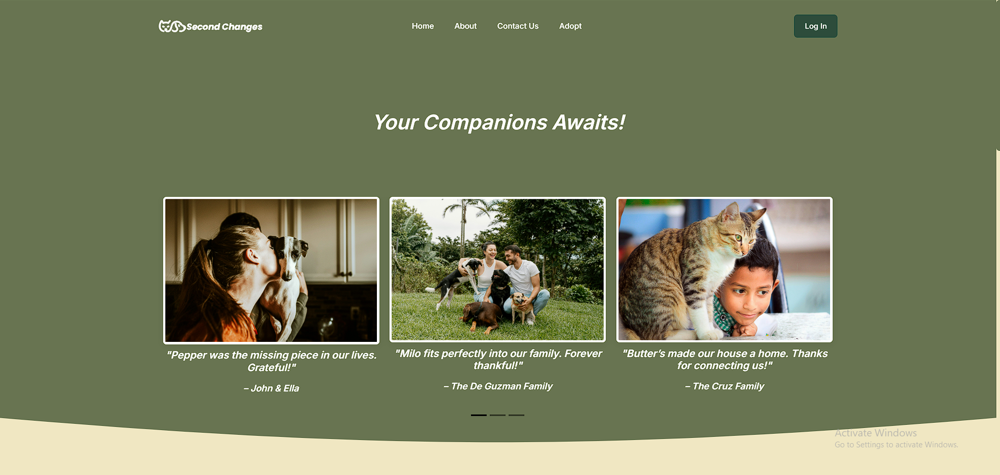

### Adoption Page
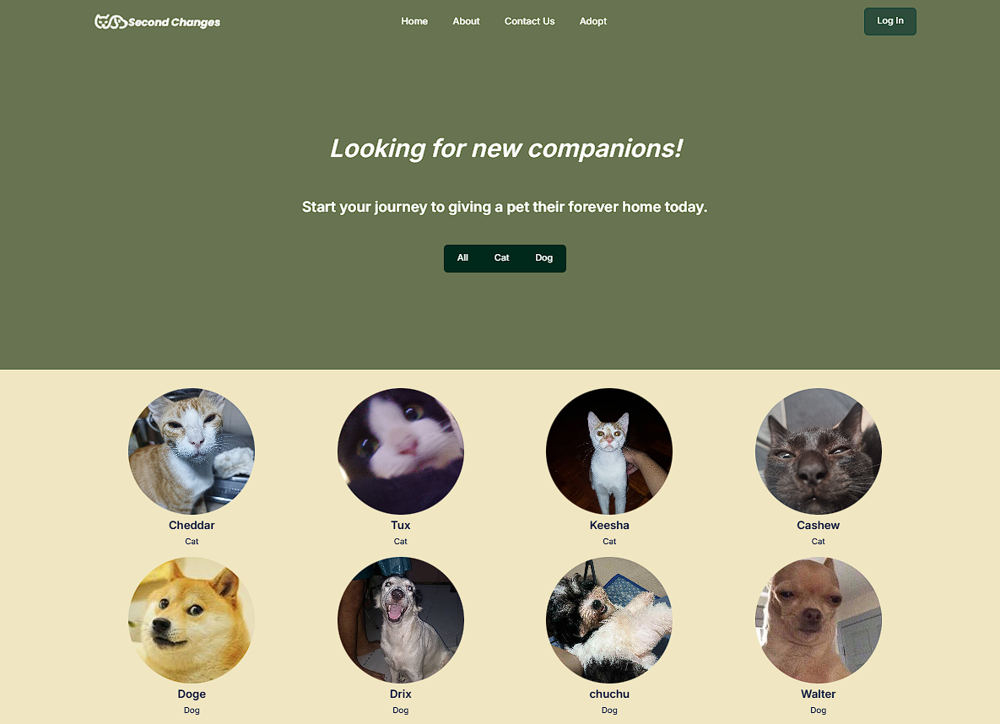

### User Profile
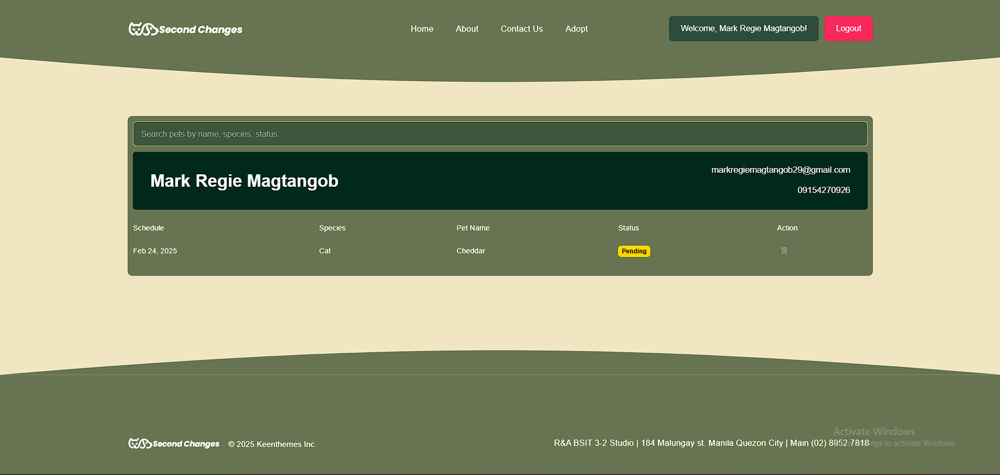

### Pet Summary Page
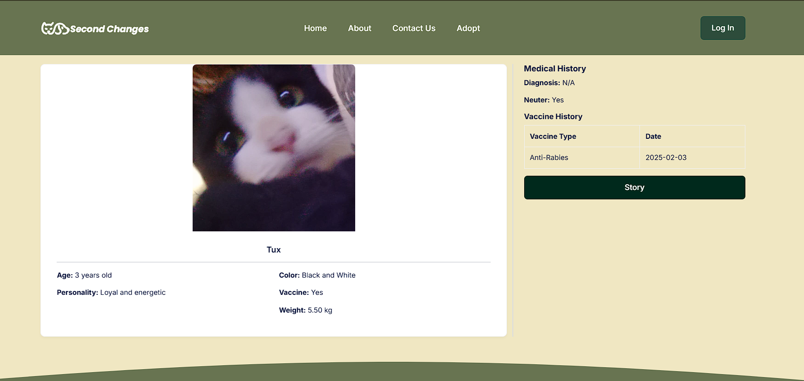

### Adoption form
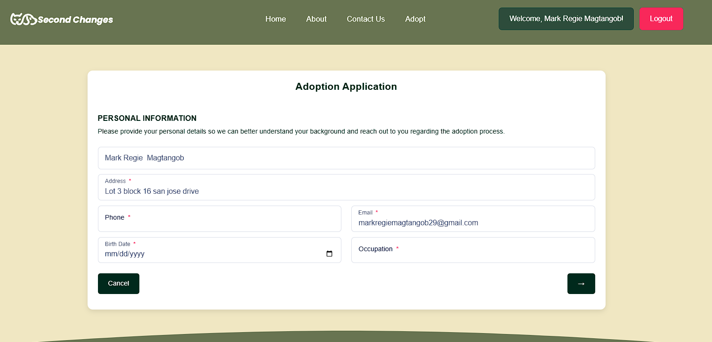

### Confirmation form 
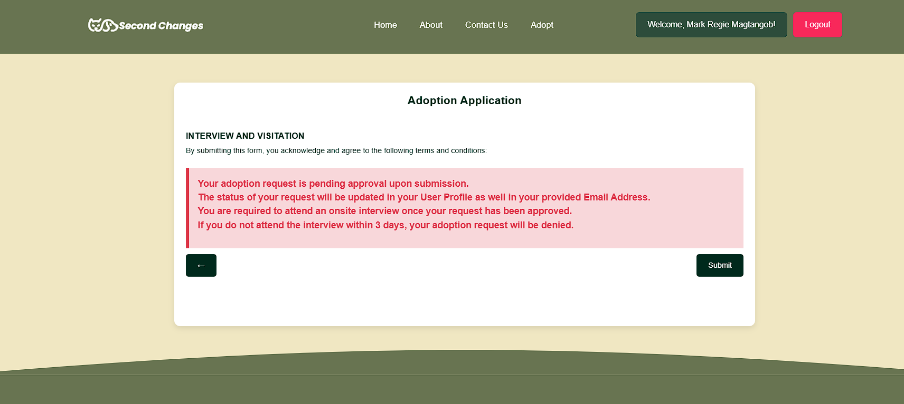

### Pets Dashboard 
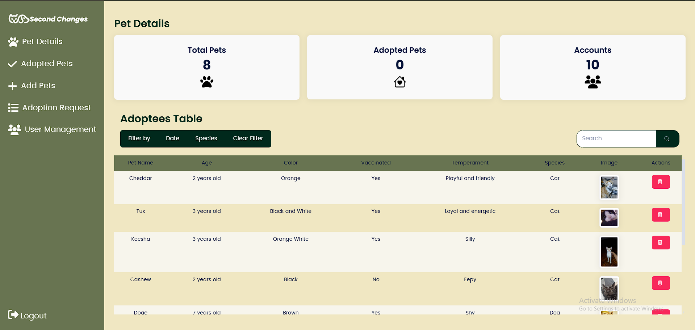

### Adoption request
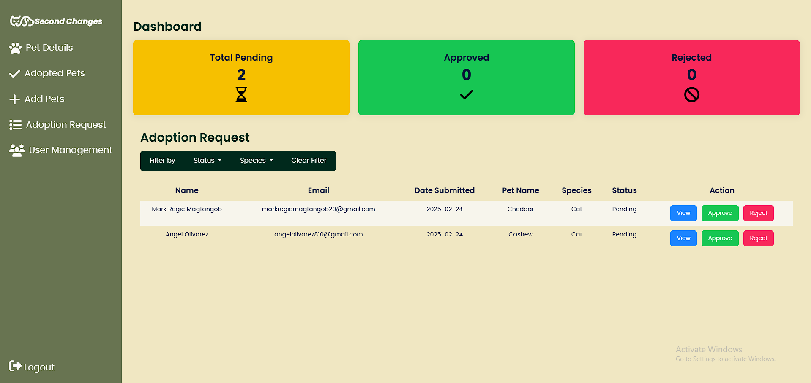

### Adoption request summary
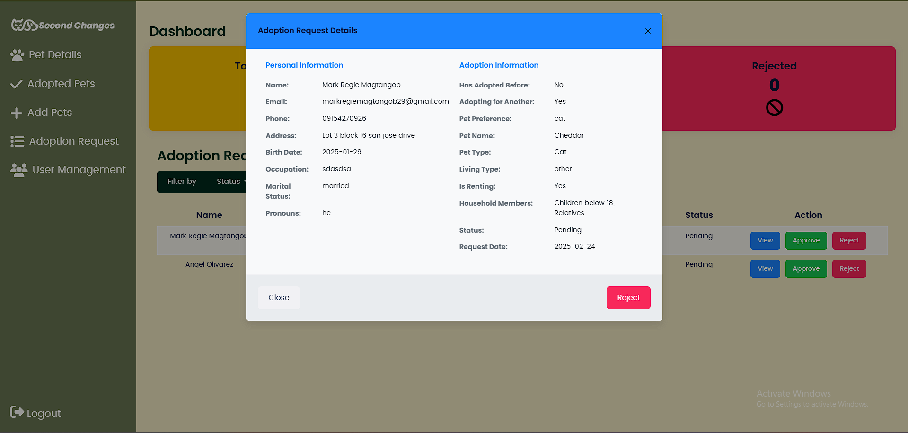

### Adopted pets
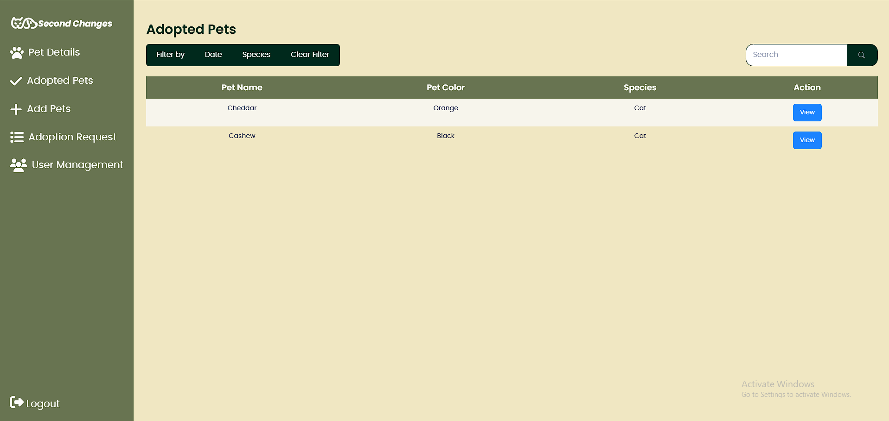

### View of Adopted Pet
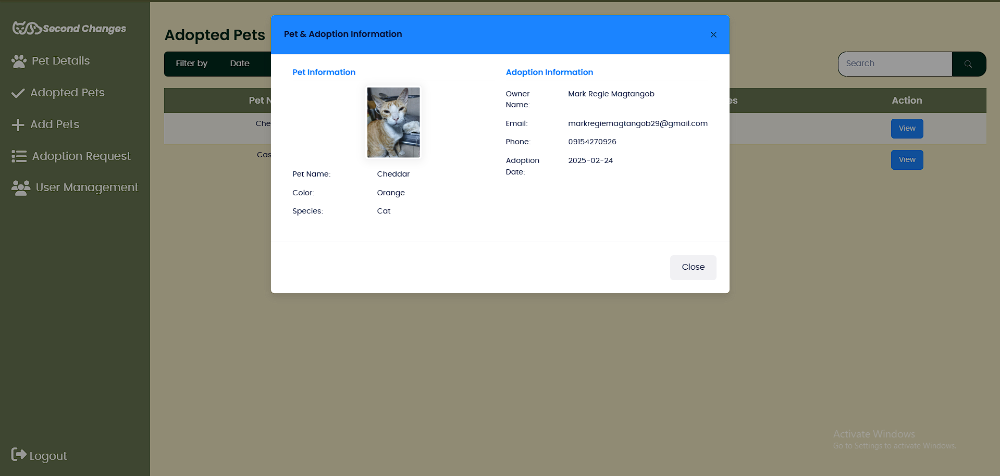

### User management
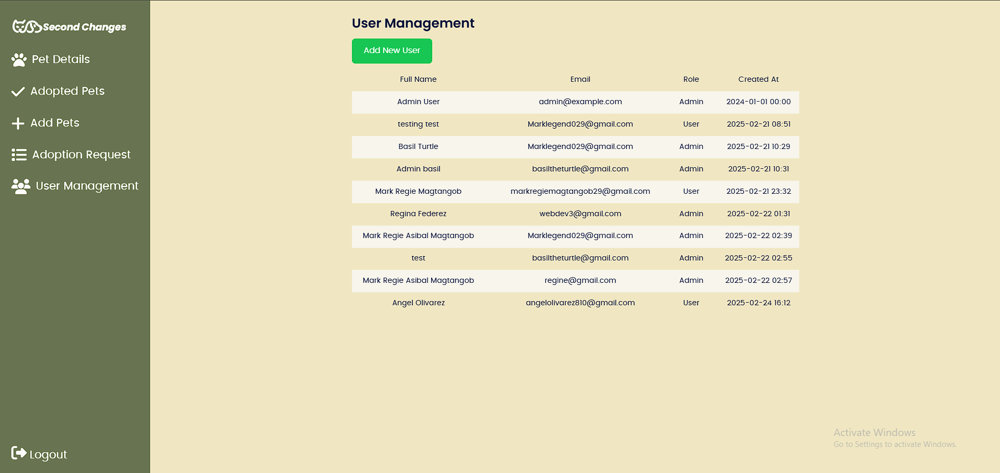

